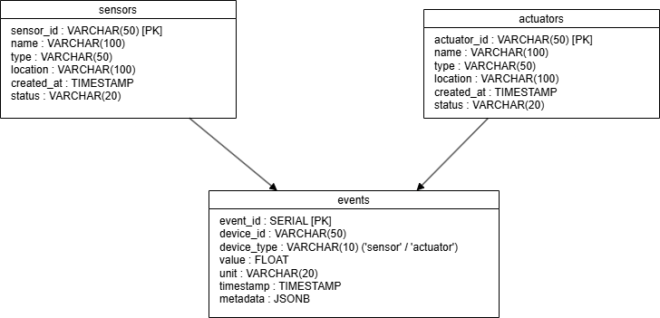
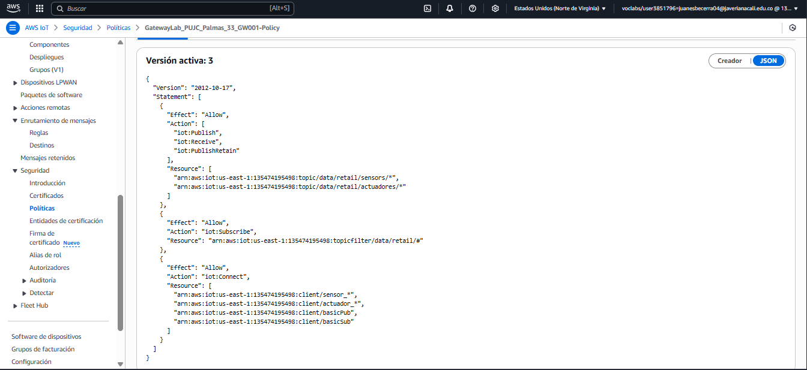
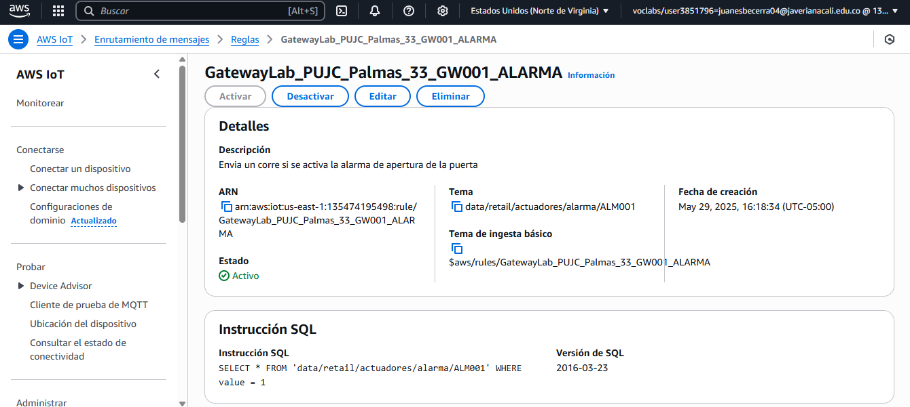

# Proyecto Final IoT - Sensores y Actuadores Retail con AWS IoT Core

## Autores

- Juan Esteban Becerra
- Daniel Vasquez

## Descripción

Este proyecto implementa un sistema completo de monitoreo para entornos retail utilizando AWS IoT Core. El sistema consta de varios componentes integrados:

1. **Sensores simulados** (movimiento, apertura, RFID) que generan datos realistas
2. **Actuadores** (alarma, puerta automática) que responden a eventos
3. **Gateway MQTT** para la comunicación con AWS IoT Core
4. **Base de datos PostgreSQL** alojada en una instancia EC2 de AWS
5. **API REST** desarrollada con AWS Chalice para gestión de dispositivos y eventos

El sistema permite el monitoreo en tiempo real del estado de los sensores y actuadores, así como el almacenamiento y consulta histórica de eventos mediante la API REST.

## Requisitos

### Software y dependencias

- Python 3.6 o superior
- PostgreSQL (ejecutado en instancia EC2)
- AWS CLI configurado con permisos adecuados
- Paquetes Python requeridos (especificados en `requirements.txt`):
  - `awsiotsdk`
  - `boto3`
  - `chalice`
  - `psycopg2-binary`
  - `python-dotenv`

### Recursos AWS

- Cuenta AWS con permisos adecuados
- AWS IoT Core configurado con políticas y certificados
- Instancia EC2 para PostgreSQL
- Función Lambda desplegada por Chalice
- API Gateway para la API REST

### Certificados y Claves

- Certificados AWS IoT Core (incluidos en carpeta `gatewayPUJC`)
  - Certificado de cliente (`.cert.pem`)
  - Clave privada (`.private.key`)
  - Certificado CA raíz (`root-CA.crt`)

## Configuración Inicial

### 1. Configurar PowerShell para la ejecución de scripts

Cada vez que se quiera ejecutar scripts PowerShell (.ps1), se debe ejecutar el siguiente comando:

```powershell
Set-ExecutionPolicy -ExecutionPolicy Bypass -Scope Process
```

### 2. Instalar dependencias Python

```bash
pip install -r retail-iot-api/requirements.txt
```

### 3. Configurar variables de entorno

Para la conexión a la base de datos, se utilizan variables de entorno que pueden configurarse en `.chalice/config.json` o en un archivo `.env` en la raíz del proyecto.

## Arquitectura del Sistema

El proyecto sigue una arquitectura de microservicios que integra dispositivos IoT (sensores y actuadores), comunicación MQTT a través de AWS IoT Core, una base de datos PostgreSQL y una API REST desarrollada con AWS Chalice:

1. **Sensores y Actuadores simulados** - Generan y publican datos mediante MQTT
2. **AWS IoT Core** - Gestiona la comunicación entre dispositivos
3. **Base de datos PostgreSQL** - Almacena registros de dispositivos y eventos
4. **API REST (AWS Chalice)** - Proporciona endpoints para gestionar los dispositivos y consultar eventos
5. **Sistema de almacenamiento de eventos** - Integrado en el script de suscripción MQTT

### Modelo Estrella

El sistema utiliza un modelo estrella para organizar los datos en la base de datos PostgreSQL. A continuación se muestra una representación gráfica del modelo:



### AWS IoT Core - Tópicos y Reglas

La comunicación entre dispositivos IoT y AWS IoT Core se realiza mediante tópicos MQTT y reglas configuradas en AWS IoT Core. La siguiente imagen muestra la estructura de los tópicos y las reglas:




## Estructura del Proyecto

```
IoT_Final_Project-Becerra/
├── gatewayPUJC/                # Gateway y configuración AWS IoT
│   ├── Gateway/
│   │   ├── pub.py           # Script para publicar mensajes MQTT
│   │   └── sub.py           # Script para suscribirse a tópicos y almacenar eventos
│   ├── root-CA.crt           # Certificado CA raíz de AWS IoT
│   ├── *.pem                 # Certificados y claves para AWS IoT
│   └── start_sub.ps1         # Script para iniciar la suscripción MQTT
├── Sensors_y_Actuadores/     # Implementación de sensores y actuadores
│   ├── sensor_movimiento.py  # Simula un sensor de movimiento
│   ├── sensor_apertura.py    # Simula un sensor de apertura de puertas/ventanas
│   ├── etiqueta_rfid.py      # Simula etiquetas RFID para productos
│   ├── actuador_alarma.py    # Simula un actuador de alarma
│   └──  actuador_puerta.py    # Simula un actuador de puerta automática
├── retail-iot-api/           # API REST con AWS Chalice
│   ├── app.py                # Aplicación principal de Chalice con endpoints
│   ├── chalicelib/           # Biblioteca de funciones auxiliares
│   │   ├── __init__.py
│   │   ├── db.py             # Funciones de acceso a la base de datos
│   │   └── utils.py          # Utilidades generales y procesamiento de datos
│   ├── .chalice/            # Configuración de Chalice
│   │   └── config.json       # Configuración de despliegue y variables de entorno
│   └── requirements.txt      # Dependencias de la API
├── ec2-user-data-postgresql.sh # Script de inicialización para la instancia EC2 con PostgreSQL
└── README.md                 # Documentación del proyecto
```

### Componentes principales

- **pub.py**: Publicador MQTT configurable para enviar datos a AWS IoT Core
- **sub.py**: Suscriptor MQTT que recibe mensajes y los almacena en la base de datos
- **Sensores y Actuadores**: Clases Python que simulan dispositivos IoT y publican sus estados
- **db.py**: Proporciona funciones para interactuar con la base de datos PostgreSQL
- **app.py**: Define los endpoints de la API REST mediante AWS Chalice
- **ec2-user-data-postgresql.sh**: Script que configura la instancia EC2 con PostgreSQL

## Uso del Sistema

### 1. Iniciar la Base de Datos PostgreSQL

La base de datos PostgreSQL se ejecuta en una instancia EC2 de AWS. Para verificar su estado, puedes usar el endpoint proporcionado en la configuración:

```bash
psql -h [DB_HOST] -U dok -d iot_final_project
# Contraseña: dok
```

### 2. Desplegar la API REST con Chalice

Para desplegar la API REST en AWS:

```bash
cd retail-iot-api
chalice deploy
```

Esto desplegará la API en AWS Lambda y API Gateway, mostrando la URL de acceso.

### 3. Iniciar los Sensores y Actuadores

Para iniciar los sensores individuales ejecutando directamente los archivos Python:

```powershell
python .\sensor_movimiento.py
```

### 4. Monitorear los Mensajes MQTT y Almacenar Eventos

Este script se suscribe a los tópicos MQTT configurados y almacena los eventos en la base de datos:

```powershell
cd .\gatewayPUJC\
Set-ExecutionPolicy -ExecutionPolicy Bypass -Scope Process
.\start_sub.ps1
```

## Acceder a PostgreSQL

Para interactuar con la base de datos PostgreSQL desde la instancia EC2, utiliza los siguientes comandos:

```bash
sudo -u postgres psql
```

### Comandos útiles en PostgreSQL

- **Listar bases de datos**:

  ```sql
  \l
  ```

- **Conectar a la base de datos del proyecto**:

  ```sql
  \c iot_final_project
  ```

- **Listar tablas**:

  ```sql
  \dt
  ```

- **Ver detalles de una tabla específica**:
  ```sql
  \d <nombre tabla>
  ```

## Verificar el estado del servicio con Postman

Para comprobar el estado del servicio API REST, utiliza el siguiente endpoint:

```bash
https://f0a2m1sl1l.execute-api.us-east-1.amazonaws.com/dev/health
```

El servicio debe devolver el estado `healthy`.

## Requerimientos para la máquina de suscripción (Windows)

Asegúrate de que la máquina que ejecutará el script de suscripción cumpla con los siguientes requisitos:

1. **Software necesario**:

   - Git
   - Python 3.13.2

2. **Instalar dependencias**:

   ```bash
   pip install awsiotsdk
   pip install AWSIoTPythonSDK
   pip install psycopg2-binary
   pip install python-dotenv
   ```

3. **Configurar PowerShell para ejecutar scripts**:

   ```powershell
   Set-ExecutionPolicy -ExecutionPolicy Bypass -Scope Process
   ```

4. **Ejecutar el script de suscripción**:
   ```powershell
   .\start_sub.ps1
   ```

### 5. Interactuar con la API REST

Utiliza herramientas como Postman o curl para interactuar con la API REST:

```bash
# Listar todos los sensores
curl https://[API_URL]/sensors

# Registrar un nuevo sensor
curl -X POST https://[API_URL]/sensors -H "Content-Type: application/json" -d '{"sensor_id": "MOV001", "name": "Sensor de Movimiento Almacén", "type": "movimiento", "location": "Almacén Principal"}'

# Consultar eventos de un sensor
curl https://[API_URL]/sensors/MOV001/events
```

## Comunicación MQTT

### Estructura de Tópicos MQTT

El proyecto utiliza una estructura jerárquica de tópicos MQTT para organizar la comunicación entre dispositivos:

**Para sensores:**

```
data/retail/sensors/{tipo_sensor}/{id_sensor}
```

Donde:

- `{tipo_sensor}`: Puede ser `movimiento`, `apertura`, o `rfid`
- `{id_sensor}`: Identificador único del sensor (ej. `MOV001`, `APE001`, `RFID001`)

**Para actuadores:**

```
data/retail/actuadores/{tipo_actuador}/{id_actuador}
```

Donde:

- `{tipo_actuador}`: Puede ser `alarma` o `puerta`
- `{id_actuador}`: Identificador único del actuador (ej. `ALM001`, `PTA001`)

**Ejemplos de tópicos:**

- `data/retail/sensors/movimiento/MOV001`
- `data/retail/sensors/apertura/APE001`
- `data/retail/sensors/rfid/RFID001`
- `data/retail/actuadores/alarma/ALM001`
- `data/retail/actuadores/puerta/PTA001`

### Formato de Mensajes

Todos los dispositivos publican mensajes JSON con la siguiente estructura base:

```json
{
  "sensor": "tipo_dispositivo_id",
  "value": valor_numerico,
  "unit": "unidad_medida",
  "timestamp": "2025-05-29T14:30:00Z",
  ...campos_adicionales_especificos
}
```

**Campos comunes:**

- `sensor`: Nombre del sensor/actuador en formato `tipo_ID` (ej. `movimiento_MOV001`)
- `value`: Valor numérico del estado (generalmente 0=inactivo, 1=activo)
- `unit`: Unidad de medida (generalmente "estado" para sensores binarios)
- `timestamp`: Marca de tiempo en formato ISO 8601

**Campos adicionales específicos:**

- Sensor de movimiento:

  ```json
  {
    "sensor": "movimiento_MOV001",
    "value": 1,
    "unit": "estado",
    "area": "Almacén Principal",
    "timestamp": "2025-05-29T14:30:00Z"
  }
  ```

- Etiqueta RFID:

  ```json
  {
    "sensor": "rfid_RFID001",
    "value": 1,
    "unit": "estado",
    "product_id": "SKU12345",
    "location": "Sección Electrónicos",
    "timestamp": "2025-05-29T14:35:00Z"
  }
  ```

- Actuador de alarma:
  ```json
  {
    "sensor": "alarma_ALM001",
    "value": 1,
    "unit": "estado",
    "tipo": "Sirena y Luz Estroboscópica",
    "ubicacion": "Tienda Completa",
    "timestamp": "2025-05-29T14:40:00Z"
  }
  ```

## Base de Datos PostgreSQL

El sistema utiliza una base de datos PostgreSQL alojada en una instancia EC2 de AWS para almacenar los datos de sensores, actuadores y eventos. La estructura de la base de datos es la siguiente:

### Tablas de la Base de Datos

#### Tabla `sensors`

| Columna    | Tipo         | Descripción                                 |
| ---------- | ------------ | ------------------------------------------- |
| sensor_id  | VARCHAR(50)  | Identificador único del sensor (PK)         |
| name       | VARCHAR(100) | Nombre descriptivo del sensor               |
| type       | VARCHAR(50)  | Tipo de sensor (movimiento, apertura, rfid) |
| location   | VARCHAR(100) | Ubicación del sensor                        |
| created_at | TIMESTAMP    | Fecha de creación del registro              |
| status     | VARCHAR(20)  | Estado del sensor (activo/inactivo)         |

#### Tabla `actuators`

| Columna     | Tipo         | Descripción                           |
| ----------- | ------------ | ------------------------------------- |
| actuator_id | VARCHAR(50)  | Identificador único del actuador (PK) |
| name        | VARCHAR(100) | Nombre descriptivo del actuador       |
| type        | VARCHAR(50)  | Tipo de actuador (alarma, puerta)     |
| location    | VARCHAR(100) | Ubicación del actuador                |
| created_at  | TIMESTAMP    | Fecha de creación del registro        |
| status      | VARCHAR(20)  | Estado del actuador (activo/inactivo) |

#### Tabla `events`

| Columna     | Tipo        | Descripción                           |
| ----------- | ----------- | ------------------------------------- |
| event_id    | SERIAL      | Identificador único del evento (PK)   |
| device_id   | VARCHAR(50) | ID del sensor o actuador              |
| device_type | VARCHAR(10) | Tipo de dispositivo (sensor/actuador) |
| value       | FLOAT       | Valor registrado                      |
| unit        | VARCHAR(20) | Unidad de medida                      |
| timestamp   | TIMESTAMP   | Fecha y hora del evento               |
| metadata    | JSONB       | Datos adicionales en formato JSON     |

## API REST con AWS Chalice

El proyecto incluye una API REST desarrollada con AWS Chalice que proporciona acceso a los datos de sensores, actuadores y eventos almacenados en PostgreSQL.

### Endpoints de la API

| Método | Ruta                        | Funcionalidad                 | Descripción                                             |
| ------ | --------------------------- | ----------------------------- | ------------------------------------------------------- |
| GET    | /sensors                    | Listar sensores registrados   | Devuelve todos los sensores registrados en el sistema   |
| POST   | /sensors                    | Registrar un nuevo sensor     | Crea un nuevo sensor con los datos proporcionados       |
| GET    | /sensors/{sensor_id}/events | Ver eventos de un sensor      | Muestra el historial de eventos de un sensor específico |
| GET    | /actuators                  | Listar actuadores registrados | Devuelve todos los actuadores registrados en el sistema |
| POST   | /actuators                  | Registrar un nuevo actuador   | Crea un nuevo actuador con los datos proporcionados     |
| GET    | /health                     | Verificar estado de la API    | Endpoint para verificar que la API está funcionando     |

### Formato de solicitudes POST

#### Registrar un sensor

```json
{
  "sensor_id": "MOV001",
  "name": "Sensor de Movimiento Almacén",
  "type": "movimiento",
  "location": "Almacén Principal",
  "status": "active"
}
```

#### Registrar un actuador

```json
{
  "actuator_id": "ALM001",
  "name": "Alarma de Seguridad Principal",
  "type": "alarma",
  "location": "Tienda Completa",
  "status": "active"
}
```

### Despliegue de la API

La API se despliega en AWS Lambda y API Gateway mediante el framework Chalice. El archivo `.chalice/config.json` contiene la configuración necesaria para el despliegue, incluyendo variables de entorno para la conexión a la base de datos.

```json
{
  "version": "2.0",
  "app_name": "retail-iot-api",
  "stages": {
    "dev": {
      "environment_variables": {
        "DB_HOST": "[DB_ENDPOINT]",
        "DB_NAME": "iot_final_project",
        "DB_USER": "dok",
        "DB_PASSWORD": "dok",
        "DB_PORT": "5432"
      }
    }
  }
}
```

### Componentes de la API

- **app.py** - Define los endpoints y maneja las solicitudes HTTP
- **chalicelib/db.py** - Contiene funciones para interactuar con PostgreSQL
- **chalicelib/utils.py** - Proporciona utilidades para validación y procesamiento de datos

### Configuración de la instancia EC2 con PostgreSQL

La base de datos PostgreSQL se ejecuta en una instancia EC2 configurada con un script de inicialización (`ec2-user-data-postgresql.sh`). Este script instala PostgreSQL, crea la base de datos y configura las tablas necesarias al iniciar la instancia.

## Resolución de Problemas

### Errores de Conexión a la Base de Datos

Si experimentas errores de conexión a la base de datos:

1. **Verifica que la instancia EC2 esté en ejecución** - Comprueba la consola de AWS
2. **Verifica la configuración de red** - Asegúrate de que los grupos de seguridad permitan conexiones al puerto 5432
3. **Prueba la conexión directamente** - Usa `psql` para conectarte manualmente

### Errores en la API (502 Bad Gateway)

Este error suele ocurrir cuando la API no puede serializar objetos datetime:

1. **Asegúrate de convertir todos los objetos datetime a strings** - En las funciones que devuelven datos de la base de datos
2. **Verifica los logs de CloudWatch** - Para obtener más detalles sobre el error
3. **Usa el endpoint `/health` para verificar la conectividad** - Sin necesidad de acceder a la base de datos

### Problemas con los sensores o MQTT

1. **Verifica los certificados AWS IoT** - Asegúrate de que estén en la ubicación correcta
2. **Comprueba la conectividad a AWS IoT Core** - Usa herramientas como el Monitor de pruebas MQTT de AWS IoT
3. **Revisa los mensajes de error en la consola** - Al ejecutar los sensores o el script de suscripción

## Conclusiones

Este proyecto demuestra una implementación completa de un sistema IoT para retail utilizando AWS IoT Core, combinando:

1. **Simulación de dispositivos IoT** - Sensores y actuadores realistas
2. **Comunicación MQTT** - Protocolo estándar para IoT
3. **Almacenamiento de datos** - Persistencia en PostgreSQL
4. **API REST** - Acceso a datos mediante servicios serverless

El sistema es extensible y puede adaptarse para incluir nuevos tipos de sensores, actuadores y funcionalidades adicionales según sea necesario para el entorno retail.

## Licencia

Este proyecto está bajo la **Licencia MIT** - ver el archivo [LICENSE](LICENSE) para más detalles.
